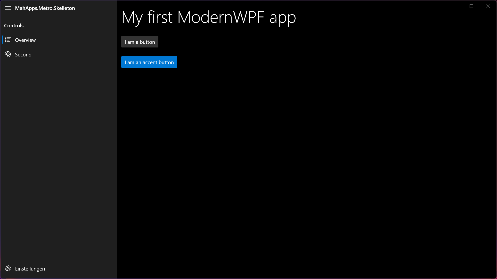
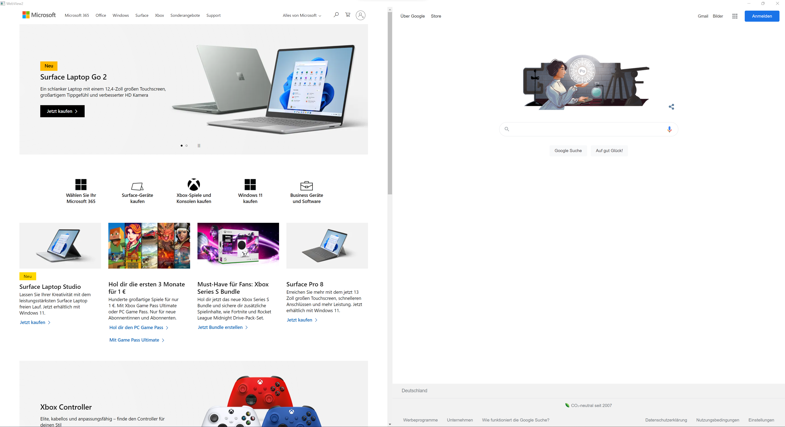

# ModernWPF by .Net Core and PrismLibrary

> This project contains multiple boilerplate projects by modern wpf skelleton projects to allow you to quickly build an modern windows based mvvm projects with PrismLibrary.

Source code examples are used from ModernWPF and extracted to minimalistic boiler plate code base and .Net Core 6.

## Examples

### MahApps.PrismLibrary.Skeleton
  * Boilerplate code for an empty prism library wpf application by ivy doc

### [MahApps.PrismLibrary.Metro](https://github.com/Kinnara/ModernWpf/wiki/MahApps.Metro-Integration)
  *  Windows metro design example by prism library as wpf application based on prism library skeleton.
  
  
  
### [MahApps.PrismLibrary.WebView2](https://docs.microsoft.com/de-de/microsoft-edge/webview2/get-started/wpf)
  *  Microsoft WebView2 sample implementation.
  
  

## Useful links
  * [Modern WPF](https://github.com/Kinnara/ModernWpf)
  * [Prism Library](https://prismlibrary.com)
